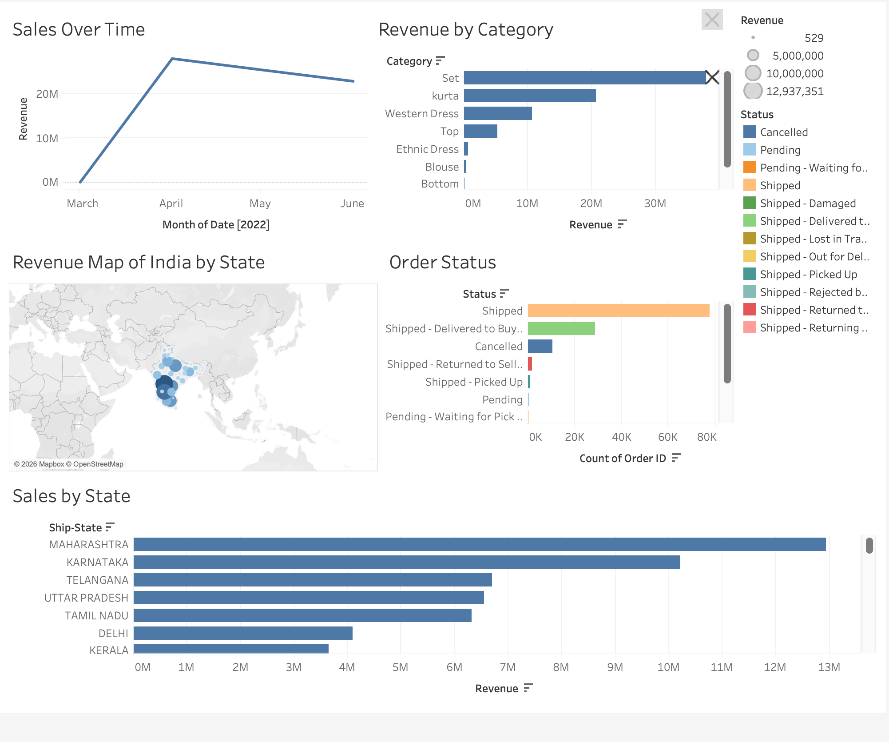

# E-Commerce Sales Analysis
End-to-end data analysis project using SQL, Python, and  Tableau to analyze e-commerce

## Tools Used
- SQL (MySQL)
- Python (Pandas, Matplotlib)
- Tableau

  ## Dashboard Preview

## Project Goals
- Analyze sales trends
- Identify top performing categories
- Understand order status distribution
- Visualize revenue across regions

## Dataset
E-commerce sales dataset containing:
- Order ID
- Category
- Revenue
- Order Status
- Ship State
- Date

## Analysis Steps

### SQL
- Revenue by category
- Revenue by state
- Monthly revenue
- Rolling average revenue

### Python
- Data cleaning
- Exploratory data analysis
- Visualization

### Tableau Dashboard
The dashboard includes:

- Sales over time
- Revenue by category
- Revenue map by state
- Order status distribution
- Sales by state

- ## Key Insights

- Set category generated the highest revenue
- Maharashtra produced the largest share of total sales
- Most orders were successfully shipped
- Revenue peaked in April before declining slightly

## Repository Structure
ecommerce-sales-analysis
│
├── clean_sales.csv.zip
├── SQL_queries.sql
├── data_cleaning.ipynb
├── tableau_dashboard.png
└── README.md

## Author

Alfred Quenum
Data analysis project using SQL, Python, and Tableau.
